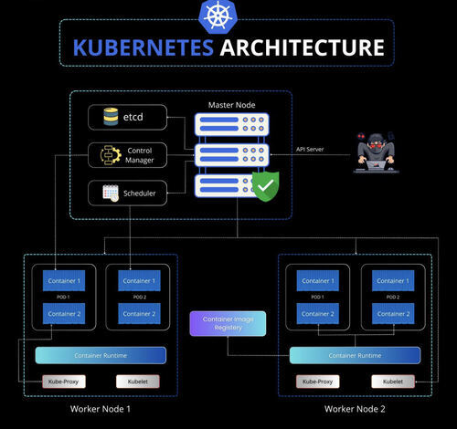

# kubernetes-cheat-sheet

This repository contains a list of commonly used kubernetes architecture, commands and flags.

> Kubernetes, often abbreviated as K8s, is an open source container orchestration engine for automating deployment, scaling, and management of containerized applications.

> [kubernetes cheat sheet official documentation](https://kubernetes.io/docs/reference/kubectl/cheatsheet/)

## Kubernetes Architecture

Kubernetes architecture is built around a set of key components that work together to ensure the reliable and efficient operation of containerized workloads. Here's a brief description of its architecture Components.

- **Control Plane (Master Node)**:
  - **API Server:** The central control point for all interactions with the cluster, exposing the Kubernetes API.
  - **Etcd:** A distributed key-value store for storing cluster configuration data.
  - **Scheduler:** Responsible for placing workloads onto nodes in the cluster.
  - **Controller Manager:** Manages controllers that regulate system state.
  - **Cloud Controller Manager (optional):** Interfaces with cloud provider APIs for managing cloud-specific resources.

- **Nodes**:
  - **Kubelet:** An agent on each node that communicates with the control plane, managing containers.
  - **Kube Proxy:** Maintains network rules and handles network traffic.
  - **Container Runtime:** Executes and manages container processes.
  - **Pod:** The smallest deployable unit, containing one or more containers.

> Here's a brief description of kubernetes architecture overview.

## How Kubernetes Works

Kubernetes follows a declarative model, where you specify the desired state of your application, and Kubernetes takes care of making it happen. Here's a simplified workflow:

- 1. You define your application's desired state using manifests (YAML files) for resources like Pods, Deployments, and Services.
- 2. These manifests are submitted to the Kubernetes API Server.
- 3. The API Server stores this desired state in Etcd.
- 4. The Scheduler places Pods on suitable nodes based on resource availability and constraints.
- 5. Kubelet agents on nodes ensure Pods are running as specified.
- 6. Kube Proxy manages network rules to enable communication between Pods.
- 7. Controllers continuously monitor and reconcile the actual state with the desired state.

## Benefits of Kubernetes

- **High Availability:** Kubernetes is designed for resilience, with no single point of failure in its control plane.
- **Scalability:** Easily scale your applications up or down by adding or removing nodes.
- **Declarative Configuration:** Define what your application should look like, and Kubernetes ensures it stays that way.
- **Self-Healing:** Kubernetes automatically replaces failed containers or nodes.
- **Portability:** Run your applications consistently across various cloud providers or on-premises.

## Conclusion

Understanding the Kubernetes architecture is crucial for effectively deploying and managing containerized applications. This powerful platform simplifies complex tasks, making it a go-to choice for modern application orchestration.

For more in-depth documentation and resources, refer to the [official Kubernetes documentation](https://kubernetes.io/docs/).

## Author(s)

- [Mansour KA](mansourka.com)

